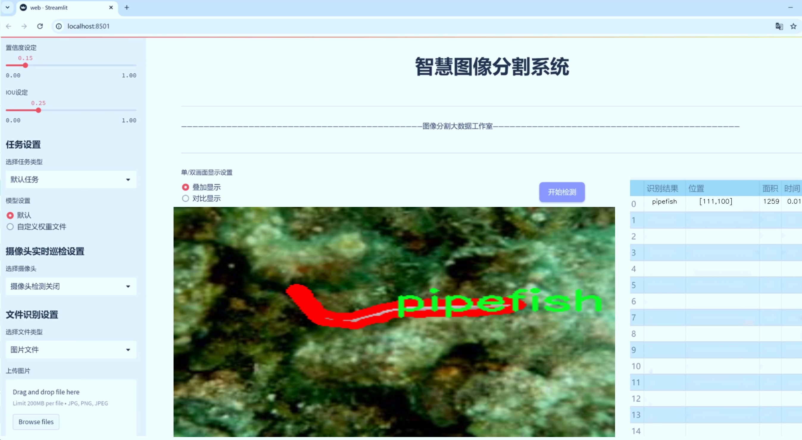
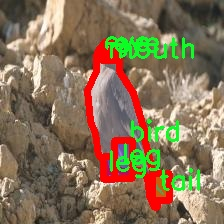

# 各类动物部位图像分割系统源码＆数据集分享
 [yolov8-seg-convnextv2＆yolov8-seg-C2f-SCcConv等50+全套改进创新点发刊_一键训练教程_Web前端展示]

### 1.研究背景与意义

项目参考[ILSVRC ImageNet Large Scale Visual Recognition Challenge](https://gitee.com/YOLOv8_YOLOv11_Segmentation_Studio/projects)

项目来源[AAAI Global Al lnnovation Contest](https://kdocs.cn/l/cszuIiCKVNis)

研究背景与意义

随着计算机视觉技术的快速发展，图像分割作为其中一个重要的研究方向，已经在多个领域得到了广泛应用。尤其是在生物学和生态学研究中，动物图像的精确分割不仅有助于物种识别和分类，还能为生态监测、保护和管理提供重要的数据支持。近年来，深度学习方法的兴起，尤其是基于卷积神经网络（CNN）的实例分割技术，极大地推动了图像分割的精度和效率。其中，YOLO（You Only Look Once）系列模型因其高效的实时检测能力而受到广泛关注。YOLOv8作为该系列的最新版本，结合了多种先进的技术，具备了更强的特征提取和分割能力。

本研究旨在基于改进的YOLOv8模型，构建一个针对各类动物部位的图像分割系统。该系统将使用MURDOC数据集，该数据集包含2000张图像，涵盖84个动物类别，涉及从昆虫到哺乳动物的多种生物。数据集中的类别包括常见的动物如猫、狗、鸟类等，也包括一些较为特殊的物种如海马、变色龙等，具有较高的多样性和复杂性。这为研究提供了丰富的样本，使得模型在训练过程中能够学习到不同动物的特征，从而提高分割的准确性和鲁棒性。

动物部位的精确分割在多个领域具有重要的实际意义。在生态学研究中，能够准确识别和分割动物的不同部位，有助于研究者分析动物的行为、生态习性及其与环境的相互作用。在保护生物多样性方面，快速而准确的动物部位识别与分割技术能够为物种监测、栖息地评估和保护措施的制定提供重要的数据支持。此外，在医学影像学中，动物模型的使用也越来越普遍，精确的图像分割能够帮助研究者更好地理解疾病机制和治疗效果。

然而，现有的图像分割技术在处理复杂背景、遮挡以及多种类动物共存的情况下，仍然面临着许多挑战。YOLOv8的改进版本通过引入更深层次的网络结构和优化的损失函数，能够更好地处理这些问题，从而提高分割的精度和速度。通过对MURDOC数据集的分析与训练，本研究不仅能够验证改进YOLOv8模型在动物部位图像分割中的有效性，还能够为未来的生态监测和生物多样性保护提供新的技术手段。

综上所述，本研究的开展具有重要的理论和实践意义。通过构建基于改进YOLOv8的动物部位图像分割系统，不仅能够推动计算机视觉技术在生物学领域的应用，还能为生态保护和物种监测提供强有力的技术支持，助力实现可持续发展目标。

### 2.图片演示





##### 注意：由于此博客编辑较早，上面“2.图片演示”和“3.视频演示”展示的系统图片或者视频可能为老版本，新版本在老版本的基础上升级如下：（实际效果以升级的新版本为准）

  （1）适配了YOLOV8的“目标检测”模型和“实例分割”模型，通过加载相应的权重（.pt）文件即可自适应加载模型。

  （2）支持“图片识别”、“视频识别”、“摄像头实时识别”三种识别模式。

  （3）支持“图片识别”、“视频识别”、“摄像头实时识别”三种识别结果保存导出，解决手动导出（容易卡顿出现爆内存）存在的问题，识别完自动保存结果并导出到tempDir中。

  （4）支持Web前端系统中的标题、背景图等自定义修改，后面提供修改教程。

  另外本项目提供训练的数据集和训练教程,暂不提供权重文件（best.pt）,需要您按照教程进行训练后实现图片演示和Web前端界面演示的效果。

### 3.视频演示

[3.1 视频演示](https://www.bilibili.com/video/BV1hPy5YkE4t/)

### 4.数据集信息展示

##### 4.1 本项目数据集详细数据（类别数＆类别名）

nc: 84
names: ['ant', 'arm', 'bat', 'batfish', 'bear', 'bee', 'beetle', 'bird', 'bittern', 'bug', 'butterfly', 'cat', 'caterpillar', 'centipede', 'chameleon', 'cheetah', 'cicada', 'clownfish', 'crab', 'crocodile', 'crocodilefish', 'deer', 'dog', 'dolphin', 'dragonfly', 'duck', 'ear', 'eye', 'fin', 'fish', 'flounder', 'fox', 'frog', 'frogfish', 'frogmouth', 'gecko', 'ghostpipefish', 'giraffe', 'goat', 'grasshopper', 'grouse', 'heron', 'horse', 'human', 'kangaroo', 'katydid', 'leafyseadragon', 'leg', 'leopard', 'lion', 'lizard', 'mantis', 'mockingbird', 'monkey', 'moth', 'mouth', 'nose', 'octopus', 'other', 'owl', 'owlfly', 'pagurian', 'pipefish', 'rabbit', 'raccoon', 'sciuridae', 'scorpionfish', 'seahorse', 'seal', 'shadow', 'sheep', 'shrimp', 'slug', 'snake', 'spider', 'starfish', 'stickinsect', 'stingaree', 'tail', 'tiger', 'toad', 'turtle', 'weasel', 'wolf']


##### 4.2 本项目数据集信息介绍

数据集信息展示

在本研究中，我们采用了名为“MURDOC”的数据集，以支持对各类动物部位的图像分割系统的训练，特别是针对改进YOLOv8-seg模型的应用。该数据集包含了丰富的多样性，涵盖了84个不同的类别，展现了自然界中动物的复杂性和多样性。这些类别不仅包括常见的动物，如猫、狗、熊和狮子等，还涵盖了许多不太为人所知的生物，如蛙鱼、鬼管鱼和叶海龙等。这种多样性使得“MURDOC”数据集成为一个理想的资源，能够有效地训练和测试图像分割算法在处理不同动物部位时的表现。

“MURDOC”数据集的类别列表中，既有大型哺乳动物（如鹿、马和人类），也有小型昆虫（如蚂蚁、蜜蜂和蝴蝶），以及各种水生生物（如海马、章鱼和鱼类）。这种广泛的类别覆盖确保了模型在面对不同形态和结构的动物时，能够进行有效的分割和识别。例如，在训练过程中，模型需要学习如何区分和识别动物的不同部位，如耳朵、眼睛、鳍、尾巴等，这些都是生物学上具有重要意义的特征。

此外，数据集中还包含了一些特定的生物特征，例如“nose”（鼻子）、“fin”（鳍）和“tail”（尾巴），这些细致的分类为研究提供了更多的维度，使得模型不仅能够识别整个动物，还能对其特定部位进行精确的分割。这种细粒度的标注为后续的研究和应用提供了丰富的数据基础，尤其是在生物监测、生态研究和动物行为分析等领域。

在数据集的构建过程中，研究团队采用了高质量的图像采集和标注技术，确保每个类别的样本都具有良好的代表性和多样性。这种高标准的制作流程为后续的模型训练提供了可靠的数据支持，使得训练出的模型在实际应用中能够展现出较高的准确性和鲁棒性。

“MURDOC”数据集的应用不仅限于动物图像分割，还可以扩展到其他计算机视觉任务，如物体检测和实例分割等。通过对该数据集的深入研究，能够推动动物图像处理技术的发展，为生态保护、动物行为研究等领域提供更为精准的工具和方法。

总之，“MURDOC”数据集凭借其丰富的类别、多样的样本和高质量的标注，为改进YOLOv8-seg模型的训练提供了坚实的基础。随着技术的不断进步和数据集的不断扩展，我们期待该数据集能够在动物图像分割领域发挥更大的作用，推动相关研究的深入发展。




### 5.全套项目环境部署视频教程（零基础手把手教学）

[5.1 环境部署教程链接（零基础手把手教学）](https://www.bilibili.com/video/BV1jG4Ve4E9t/?vd_source=bc9aec86d164b67a7004b996143742dc)


[5.2 安装Python虚拟环境创建和依赖库安装视频教程链接（零基础手把手教学）](https://www.bilibili.com/video/BV1nA4VeYEze/?vd_source=bc9aec86d164b67a7004b996143742dc)

### 6.手把手YOLOV8-seg训练视频教程（零基础小白有手就能学会）

[6.1 手把手YOLOV8-seg训练视频教程（零基础小白有手就能学会）](https://www.bilibili.com/video/BV1cA4VeYETe/?vd_source=bc9aec86d164b67a7004b996143742dc)


按照上面的训练视频教程链接加载项目提供的数据集，运行train.py即可开始训练



     Epoch   gpu_mem       box       obj       cls    labels  img_size
     1/200     0G   0.01576   0.01955  0.007536        22      1280: 100%|██████████| 849/849 [14:42<00:00,  1.04s/it]
               Class     Images     Labels          P          R     mAP@.5 mAP@.5:.95: 100%|██████████| 213/213 [01:14<00:00,  2.87it/s]
                 all       3395      17314      0.994      0.957      0.0957      0.0843

     Epoch   gpu_mem       box       obj       cls    labels  img_size
     2/200     0G   0.01578   0.01923  0.007006        22      1280: 100%|██████████| 849/849 [14:44<00:00,  1.04s/it]
               Class     Images     Labels          P          R     mAP@.5 mAP@.5:.95: 100%|██████████| 213/213 [01:12<00:00,  2.95it/s]
                 all       3395      17314      0.996      0.956      0.0957      0.0845

     Epoch   gpu_mem       box       obj       cls    labels  img_size
     3/200     0G   0.01561    0.0191  0.006895        27      1280: 100%|██████████| 849/849 [10:56<00:00,  1.29it/s]
               Class     Images     Labels          P          R     mAP@.5 mAP@.5:.95: 100%|███████   | 187/213 [00:52<00:00,  4.04it/s]
                 all       3395      17314      0.996      0.957      0.0957      0.0845


### 7.50+种全套YOLOV8-seg创新点代码加载调参视频教程（一键加载写好的改进模型的配置文件）

[7.1 50+种全套YOLOV8-seg创新点代码加载调参视频教程（一键加载写好的改进模型的配置文件）](https://www.bilibili.com/video/BV1Hw4VePEXv/?vd_source=bc9aec86d164b67a7004b996143742dc)

### 8.YOLOV8-seg图像分割算法原理

原始YOLOv8-seg算法原理

YOLOv8-seg是YOLO系列中最新的目标检测与分割算法，其设计理念在于兼顾高效性与准确性，适应于多种应用场景。与前一代YOLOv5相比，YOLOv8在检测精度和速度上均有显著提升，特别是在处理复杂场景和小目标时，表现尤为突出。YOLOv8的架构主要由输入端、骨干网络、颈部网络和头部网络四个部分组成，每个部分都经过精心设计，以确保信息的高效流动和特征的有效提取。

在输入端，YOLOv8采用了多种数据增强技术，包括马赛克增强、自适应锚框计算和自适应灰度填充。这些技术不仅提高了模型的鲁棒性，还能有效扩展训练数据集的多样性，从而提升模型的泛化能力。马赛克增强通过将多个图像拼接在一起，形成一个新的训练样本，使得模型能够学习到更丰富的特征信息。自适应锚框计算则根据输入图像的特征动态调整锚框的大小和形状，以适应不同目标的检测需求。

YOLOv8的骨干网络采用了C2f模块，这一模块借鉴了YOLOv7的ELAN结构，通过更多的分支和跨层连接，显著增强了模型的梯度流动性。这种设计使得网络能够更好地学习到图像中的细微特征，尤其是在处理复杂背景或小目标时，C2f模块的优势愈加明显。此外，骨干网络中的SPPF模块通过空间金字塔池化技术，进一步提升了特征的抽象能力，使得模型在多尺度特征提取上表现出色。

颈部网络采用了路径聚合网络（PAN）结构，旨在加强不同尺度特征的融合能力。PAN通过自下而上的特征融合，将高层特征与中层、浅层特征进行有效结合，确保了模型在不同尺度下的目标检测能力。这样的设计不仅提升了模型对不同大小目标的检测精度，也增强了模型对复杂场景的适应性。

在头部网络方面，YOLOv8引入了解耦结构，将分类和回归过程分开处理。这一创新使得模型在进行目标检测时，能够更精确地进行边框回归和类别预测。头部网络的损失计算过程采用了Task-Aligned Assigner策略，根据分类与回归的分数加权结果选择正样本，从而优化了样本匹配的效率。分类分支使用二元交叉熵损失（BCELoss），而回归分支则结合了分布焦点损失（DFLoss）和完全交并比损失（CIOULoss），进一步提升了模型对边界框预测的准确性。

YOLOv8-seg的另一个重要特点是其无锚框检测的能力。通过引入Anchor-Free的思想，YOLOv8在目标检测中不再依赖于传统的锚框机制，减少了锚框预测的数量，从而加速了非最大抑制（NMS）过程。这一改进使得YOLOv8在处理复杂场景时，能够更快速地进行目标检测和分割。

此外，YOLOv8-seg在损失函数的设计上也进行了创新，采用了Focal Loss来解决样本不平衡的问题。由于在实际应用中，某些目标的像素占比可能较低，导致训练过程中正负样本数量不平衡，Focal Loss通过调节损失函数的权重，使得模型在训练时能够更加关注难以分类的样本，从而提升了模型的整体性能。

综上所述，YOLOv8-seg算法通过一系列创新设计和技术改进，成功地提升了目标检测与分割的精度和速度。其模块化的结构设计和高效的特征融合能力，使得YOLOv8在多种应用场景中都表现出色，成为当前目标检测领域的一个重要里程碑。随着YOLOv8-seg的不断发展和完善，未来的目标检测和分割任务将更加高效和精准，为各类应用提供更强大的技术支持。


### 9.系统功能展示（检测对象为举例，实际内容以本项目数据集为准）

图9.1.系统支持检测结果表格显示

  图9.2.系统支持置信度和IOU阈值手动调节

  图9.3.系统支持自定义加载权重文件best.pt(需要你通过步骤5中训练获得)

  图9.4.系统支持摄像头实时识别

  图9.5.系统支持图片识别

  图9.6.系统支持视频识别

  图9.7.系统支持识别结果文件自动保存

  图9.8.系统支持Excel导出检测结果数据


### 10.50+种全套YOLOV8-seg创新点原理讲解（非科班也可以轻松写刊发刊，V11版本正在科研待更新）

#### 10.1 由于篇幅限制，每个创新点的具体原理讲解就不一一展开，具体见下列网址中的创新点对应子项目的技术原理博客网址【Blog】：


[10.1 50+种全套YOLOV8-seg创新点原理讲解链接](https://gitee.com/qunmasj/good)

#### 10.2 部分改进模块原理讲解(完整的改进原理见上图和技术博客链接)【如果此小节的图加载失败可以通过CSDN或者Github搜索该博客的标题访问原始博客，原始博客图片显示正常】
### 可变性卷积DCN简介
卷积神经网络由于其构建模块中固定的几何结构，本质上受限于模型几何变换。为了提高卷积神经网络的转换建模能力，《Deformable Convolutional Networks》作者提出了两个模块：可变形卷积（deformable convolution）和可变形RoI池（deformable RoI pooling）。这两个模块均基于用额外的偏移来增加模块中的空间采样位置以及从目标任务中学习偏移的思想，而不需要额外的监督。

第一次证明了在深度神经网络中学习密集空间变换（dense spatial transformation）对于复杂的视觉任务是有效的

视觉识别中的一个关键挑战是如何适应对象比例、姿态、视点和零件变形中的几何变化或模型几何变换。一般有两种方法实现：
1）建立具有足够期望变化的训练数据集。这通常通过增加现有的数据样本来实现，例如通过仿射变换。但是训练成本昂贵而且模型参数庞大。
2）使用变换不变（transformation-invariant）的特征和算法。比如比较有名的SIFT(尺度不变特征变换)便是这一类的代表算法。

但以上的方法有两个缺点：
1）几何变换被假定为固定的和已知的，这些先验知识被用来扩充数据，设计特征和算法。为此，这个假设阻止了对具有未知几何变换的新任务的推广，从而导致这些几何变换可能没有被正确建模。
2）对于不变特征和算法进行手动设计，对于过于复杂的变换可能是困难的或不可行的。

卷积神经网络本质上局限于模拟大型未知转换。局限性源于CNN模块的固定几何结构：卷积单元在固定位置对输入特征图进行采样；池化层以固定比率降低特征矩阵分辨率；RoI（感兴趣区域）池化层将RoI分成固定的空间箱（spatial bins）等。缺乏处理几何变换的内部机制。

这种内部机制的缺乏会导致一些问题，举个例子。同一个CNN层中所有激活单元的感受野大小是相同的，但是这是不可取的。因为不同的位置可能对应于具有不同尺度或变形的对象，所以尺度或感受野大小的自适应确定对于具有精细定位的视觉识别是渴望的。

对于这些问题，作者提出了两个模块提高CNNs对几何变换建模的能力。


deformable convolution（可变形卷积）
将2D偏移量添加到标准卷积中的常规网格采样位置，使得采样网格能够自由变形。通过额外的卷积层，从前面的特征映射中学习偏移。因此，变形采用局部、密集和自适应的方式取决于输入特征。


deformable RoI pooling（可变形RoI池化）
为先前RoI池化的常规库（bin）分区中的每个库位置（bin partition）增加了一个偏移量。类似地，偏移是从前面的特征图和感兴趣区域中学习的，从而能够对具有不同形状的对象进行自适应部件定位（adaptive part localization）。

#### Deformable Convolutional Networks
Deformable Convolution
2D卷积由两个步骤组成：
1）在输入特征图x xx上使用规则网格R RR进行采样。
2）把这些采样点乘不同权重w ww后相加。

网格R定义感受野大小和扩张程度，比如内核大小为3x3，扩张程度为1的网格R可以表示为：
R = { ( − 1 , − 1 ) , ( − 1 , 0 ) , … , ( 0 , 1 ) , ( 1 , 1 ) } R = \{(-1,-1),(-1,0),\dots,(0,1),(1,1)\}
R={(−1,−1),(−1,0),…,(0,1),(1,1)}

​
 一般为小数，使用双线性插值进行处理。（把小数坐标分解到相邻的四个整数坐标点来计算结果）


具体操作如图所示：


首先对输入特征层进行一个普通的3x3卷积处理得到偏移域（offset field）。偏移域特征图具有与输入特征图相同的空间分辨率，channels维度2N对应于N个2D（xy两个方向）偏移。其中的N是原输入特征图上所具有的N个channels，也就是输入输出channels保持不变，这里xy两个channels分别对输出特征图上的一个channels进行偏移。确定采样点后就通过与相对应的权重w点乘相加得到输出特征图上该点最终值。

前面也提到过，由于这里xy两个方向所训练出来的偏移量一般来说是一个小数，那么为了得到这个点所对应的数值，会采用双线性插值的方法，从最近的四个邻近坐标点中计算得到该偏移点的数值，公式如下：


具体推理过程见：双线性插值原理

#### Deformable RoI Poolingb
所有基于区域提议（RPN）的对象检测方法都使用RoI池话处理，将任意大小的输入矩形区域转换为固定大小的特征图。


 一般为小数，需要使用双线性插值进行处理。


具体操作如图所示：


当时看这个部分的时候觉得有些突兀，明明RoI池化会将特征层转化为固定尺寸的区域。其实，我个人觉得，这个部分与上述的可变性卷积操作是类似的。这里同样是使用了一个普通的RoI池化操作，进行一些列处理后得到了一个偏移域特征图，然后重新作用于原来的w × H w \times Hw×H的RoI。只不过这里不再是规律的逐行逐列对每个格子进行池化，而是对于格子进行偏移后再池化处理。

#### Postion﹣Sensitive RoI Pooling
除此之外，论文还提出一种PS RoI池化（Postion﹣Sensitive RoI Pooling）。不同于上述可变形RoI池化中的全连接过程，这里使用全卷积替换。

具体操作如图所示：


首先，对于原来的特征图来说，原本是将输入特征图上的RoI区域分成k × k k\times kk×k个bin。而在这里，则是将输入特征图进行卷积操作，分别得到一个channels为k 2 ( C + 1 ) k^{2}(C+1)k (C+1)的得分图（score maps）和一个channels为2 k 2 ( C + 1 ) 2k{2}(C+1)2k 2 (C+1)的偏移域（offset fields），这两个特征矩阵的宽高是与输入特征矩阵相同的。其中，得分图的channels中，k × k k \times kk×k分别表示的是每一个网格，C CC表示的检测对象的类别数目，1表示背景。而在偏移域中的2表示xy两个方向的偏移。
也就是说，在PS RoI池化中，对于RoI的每一个网格都独自占一个通道形成一层得分图，然后其对于的偏移量占两个通道。offset fields得到的偏移是归一化后的偏移，需要通过和deformable RoI pooling中一样的变换方式得到∆ p i j ∆p_{ij}∆p ij，然后对每层得分图进行偏移池化处理。最后处理完的结果就对应着最后输出的一个网格。所以其包含了位置信息。

原文论述为：


#### Understanding Deformable ConvNets
当可变形卷积叠加时，复合变形的效果是深远的。如图所示：


ps：a是标准卷积的固定感受野，b是可变形卷积的适应性感受野。

感受野和标准卷积中的采样位置在整个顶部特征图上是固定的(左)。在可变形卷积中，它们根据对象的比例和形状进行自适应调整(右)。


### 11.项目核心源码讲解（再也不用担心看不懂代码逻辑）

#### 11.1 chinese_name_list.py

以下是对提供代码的逐行分析和核心部分的保留，并附上详细的中文注释：

```python
# -*- coding: utf-8 -*-
# 指定文件编码为 UTF-8，以支持中文字符

# 创建一个字典，包含中文名称与其对应的英文标签
Chinese_name = {'person': "人"}

# 从字典中提取所有的中文名称，生成一个列表
Label_list = list(Chinese_name.values())
```

### 核心部分分析：
1. **字典的创建**：`Chinese_name` 字典用于存储英文标签与其对应的中文名称。在这个例子中，只有一个键值对，表示“person”对应的中文是“人”。
   
2. **列表的生成**：`Label_list` 列表通过 `list(Chinese_name.values())` 语句生成，提取了字典中所有的值（即中文名称），并将其存储在一个列表中。

### 总结：
该代码的核心功能是将英文标签与中文名称进行映射，并提取出所有的中文名称形成一个列表。这样可以方便后续的处理和使用。

这个程序文件的名称是 `chinese_name_list.py`，它的主要功能是定义一个包含中文名称的字典，并从中提取出值列表。

首先，文件开头的 `# -*- coding: utf-8 -*-` 是一个编码声明，表示该文件使用 UTF-8 编码。这对于处理中文字符非常重要，因为它确保了程序能够正确读取和显示中文内容。

接下来，程序定义了一个字典 `Chinese_name`，其中包含一个键值对。键是字符串 `'person'`，对应的值是中文字符 `"人"`。这个字典的目的是为了将一些英文单词与其对应的中文翻译进行关联。

然后，程序通过 `list(Chinese_name.values())` 这行代码从字典中提取出所有的值，并将其转换为一个列表。这里，`Chinese_name.values()` 方法返回字典中所有值的视图，而 `list()` 函数则将这个视图转换为一个列表。最终，提取出的值被存储在变量 `Label_list` 中。

因此，`Label_list` 变量的内容将是一个包含中文字符的列表，在这个特定的例子中，它只包含一个元素，即 `"人"`。这个程序的结构简单明了，主要用于展示如何在 Python 中使用字典和列表来处理中文名称。

#### 11.2 ultralytics\models\yolo\__init__.py

以下是经过简化并添加详细中文注释的核心代码部分：

```python
# 导入Ultralytics YOLO模型库中的相关功能
from ultralytics.models.yolo import classify, detect, pose, segment

# 从当前模块导入YOLO类
from .model import YOLO

# 定义模块的公开接口，指定可以被外部访问的功能
__all__ = 'classify', 'segment', 'detect', 'pose', 'YOLO'
```

### 代码注释说明：

1. **导入YOLO模型功能**：
   - `from ultralytics.models.yolo import classify, detect, pose, segment`：从Ultralytics的YOLO模型库中导入了四个主要功能：
     - `classify`：用于图像分类的功能。
     - `detect`：用于目标检测的功能。
     - `pose`：用于姿态估计的功能。
     - `segment`：用于图像分割的功能。

2. **导入YOLO类**：
   - `from .model import YOLO`：从当前模块的`model`文件中导入`YOLO`类，这个类可能是YOLO模型的实现，提供了模型的初始化和操作方法。

3. **定义模块的公开接口**：
   - `__all__ = 'classify', 'segment', 'detect', 'pose', 'YOLO'`：这是一个特殊的变量，用于定义当使用`from module import *`时，哪些名称是可以被导入的。这里指定了可以被外部访问的功能和类，确保模块的接口清晰且易于使用。

这个程序文件是Ultralytics YOLO模型库的一部分，主要用于实现YOLO（You Only Look Once）系列的目标检测、分类、姿态估计和分割功能。文件的开头有一个注释，表明这是Ultralytics YOLO项目，并且使用的是AGPL-3.0许可证。

接下来，文件通过`from`语句导入了四个模块：`classify`、`detect`、`pose`和`segment`，这些模块分别对应于不同的功能，分别用于图像分类、目标检测、姿态估计和图像分割。这些功能是YOLO模型的核心应用，能够处理各种计算机视觉任务。

此外，文件还从同一目录下的`model`模块中导入了`YOLO`类，这个类可能是YOLO模型的主要实现，负责模型的构建和推理。

最后，`__all__`变量定义了该模块公开的接口，包含了`classify`、`segment`、`detect`、`pose`和`YOLO`。这意味着当使用`from ultralytics.models.yolo import *`时，只会导入这些指定的对象，帮助用户了解该模块的主要功能和使用方式。

总体来说，这个文件是Ultralytics YOLO库的一个初始化模块，负责组织和导出YOLO相关的功能和类，使得用户可以方便地使用这些功能进行计算机视觉任务。

#### 11.3 ui.py

以下是经过简化和注释的核心代码部分：

```python
import sys
import subprocess

def run_script(script_path):
    """
    使用当前 Python 环境运行指定的脚本。

    Args:
        script_path (str): 要运行的脚本路径

    Returns:
        None
    """
    # 获取当前 Python 解释器的路径
    python_path = sys.executable

    # 构建运行命令，使用 streamlit 运行指定的脚本
    command = f'"{python_path}" -m streamlit run "{script_path}"'

    # 执行命令并等待其完成
    result = subprocess.run(command, shell=True)
    
    # 检查命令执行结果，如果返回码不为0，则表示出错
    if result.returncode != 0:
        print("脚本运行出错。")

# 实例化并运行应用
if __name__ == "__main__":
    # 指定要运行的脚本路径
    script_path = "web.py"  # 假设脚本在当前目录下

    # 调用函数运行脚本
    run_script(script_path)
```

### 代码注释说明：
1. **导入模块**：
   - `sys`：用于获取当前 Python 解释器的路径。
   - `subprocess`：用于执行外部命令。

2. **`run_script` 函数**：
   - 定义一个函数，用于运行指定路径的 Python 脚本。
   - 使用 `sys.executable` 获取当前 Python 解释器的路径。
   - 构建命令字符串，使用 `streamlit` 模块运行指定的脚本。
   - 使用 `subprocess.run` 执行命令，并等待其完成。
   - 检查命令的返回码，如果不为0，打印错误信息。

3. **主程序入口**：
   - 使用 `if __name__ == "__main__":` 确保只有在直接运行该脚本时才会执行以下代码。
   - 指定要运行的脚本路径（这里假设为 `web.py`）。
   - 调用 `run_script` 函数，传入脚本路径以执行该脚本。

这个程序文件名为 `ui.py`，主要功能是使用当前的 Python 环境来运行一个指定的脚本，具体是一个名为 `web.py` 的文件。程序首先导入了必要的模块，包括 `sys`、`os` 和 `subprocess`，以及一个自定义的路径处理模块 `abs_path`。

在 `run_script` 函数中，程序接受一个参数 `script_path`，该参数是要运行的脚本的路径。函数内部首先获取当前 Python 解释器的路径，接着构建一个命令字符串，该命令使用 `streamlit` 来运行指定的脚本。`streamlit` 是一个用于构建数据应用的框架。

随后，程序使用 `subprocess.run` 方法来执行构建好的命令。该方法的 `shell=True` 参数允许在 shell 中执行命令。执行完命令后，程序检查返回的状态码，如果状态码不为零，表示脚本运行出错，则输出一条错误信息。

在文件的最后部分，程序通过 `if __name__ == "__main__":` 判断当前模块是否是主程序。如果是，程序将调用 `abs_path` 函数来获取 `web.py` 的绝对路径，并将其传递给 `run_script` 函数，从而启动脚本的运行。

整体来看，这个程序的设计简单明了，主要用于启动一个基于 Streamlit 的 web 应用，确保了在正确的 Python 环境中执行，并处理了可能出现的错误。

#### 11.4 train.py

以下是经过简化和注释的核心代码部分：

```python
import os
import torch
import yaml
from ultralytics import YOLO  # 导入YOLO模型库

if __name__ == '__main__':  # 确保该模块被直接运行时才执行以下代码
    # 设置训练参数
    workers = 1  # 数据加载的工作进程数
    batch = 8  # 每个批次的样本数量
    device = "0" if torch.cuda.is_available() else "cpu"  # 检查是否有可用的GPU，选择设备

    # 获取数据集配置文件的绝对路径
    data_path = abs_path(f'datasets/data/data.yaml', path_type='current')

    # 读取YAML文件，保持原有顺序
    with open(data_path, 'r') as file:
        data = yaml.load(file, Loader=yaml.FullLoader)

    # 修改数据集中训练、验证和测试的路径
    if 'train' in data and 'val' in data and 'test' in data:
        directory_path = os.path.dirname(data_path)  # 获取目录路径
        data['train'] = os.path.join(directory_path, 'train')  # 更新训练集路径
        data['val'] = os.path.join(directory_path, 'val')  # 更新验证集路径
        data['test'] = os.path.join(directory_path, 'test')  # 更新测试集路径

        # 将修改后的数据写回YAML文件
        with open(data_path, 'w') as file:
            yaml.safe_dump(data, file, sort_keys=False)

    # 加载YOLO模型配置文件和预训练权重
    model = YOLO(r"C:\codeseg\codenew\50+种YOLOv8算法改进源码大全和调试加载训练教程（非必要）\改进YOLOv8模型配置文件\yolov8-seg-C2f-Faster.yaml").load("./weights/yolov8s-seg.pt")

    # 开始训练模型
    results = model.train(
        data=data_path,  # 指定训练数据的配置文件路径
        device=device,  # 指定训练设备
        workers=workers,  # 指定数据加载的工作进程数
        imgsz=640,  # 输入图像的大小为640x640
        epochs=100,  # 训练100个epoch
        batch=batch,  # 每个批次的大小为8
    )
```

### 代码注释说明：
1. **导入库**：导入必要的库，包括`os`、`torch`、`yaml`和YOLO模型库。
2. **主程序入口**：使用`if __name__ == '__main__':`确保只有在直接运行该脚本时才执行后续代码。
3. **设置训练参数**：
   - `workers`：设置数据加载的工作进程数。
   - `batch`：设置每个批次的样本数量。
   - `device`：根据是否有可用的GPU选择训练设备。
4. **读取和修改数据集配置**：
   - 获取数据集配置文件的绝对路径。
   - 读取YAML文件并解析内容。
   - 更新训练、验证和测试数据的路径，并将修改后的内容写回YAML文件。
5. **加载YOLO模型**：根据指定的配置文件和预训练权重加载YOLO模型。
6. **训练模型**：调用`model.train()`方法开始训练，传入必要的参数，包括数据路径、设备、工作进程数、图像大小、训练轮数和批次大小。

该程序文件 `train.py` 是一个用于训练 YOLO（You Only Look Once）模型的脚本。首先，它导入了必要的库，包括操作系统相关的 `os`、深度学习框架 `torch`、YAML 处理库 `yaml` 以及 YOLO 模型的实现库 `ultralytics`。此外，还设置了 Matplotlib 的后端为 `TkAgg`，以便在需要时进行可视化。

在主程序中，首先设置了一些训练参数，如工作进程数 `workers` 和批次大小 `batch`。批次大小可以根据显存和内存的情况进行调整，以避免出现显存不足的错误。接着，程序会检查是否可以使用 GPU，如果可以，则将设备设置为 "0"（即第一个 GPU），否则使用 CPU。

接下来，程序通过 `abs_path` 函数获取数据集配置文件 `data.yaml` 的绝对路径，并将其转换为 UNIX 风格的路径。然后，程序提取该路径的目录部分，以便后续构建训练、验证和测试数据集的路径。通过打开 YAML 文件，程序读取其中的数据，并检查是否包含训练、验证和测试的路径。如果存在这些路径，程序会将它们修改为相对于目录的路径，并将修改后的数据写回到 YAML 文件中。

在模型加载部分，程序使用 YOLO 的配置文件加载一个预训练的模型。这里的配置文件路径是一个本地路径，指向 YOLOv8 的某个变种（如 `yolov8-seg-C2f-Faster.yaml`），并加载相应的权重文件（`yolov8s-seg.pt`）。需要注意的是，不同的模型对设备的要求不同，如果出现错误，可以尝试使用其他模型进行测试。

最后，程序调用 `model.train()` 方法开始训练模型。训练过程中，指定了数据配置文件的路径、设备、工作进程数、输入图像的大小（640x640）、训练的轮数（100个 epoch）以及每个批次的大小（8）。这样，程序便可以在指定的条件下开始训练 YOLO 模型。

#### 11.5 ultralytics\models\yolo\segment\val.py

以下是代码中最核心的部分，并附上详细的中文注释：

```python
class SegmentationValidator(DetectionValidator):
    """
    SegmentationValidator类，继承自DetectionValidator类，用于基于分割模型的验证。
    """

    def __init__(self, dataloader=None, save_dir=None, pbar=None, args=None, _callbacks=None):
        """初始化SegmentationValidator并将任务设置为'segment'，指标设置为SegmentMetrics。"""
        super().__init__(dataloader, save_dir, pbar, args, _callbacks)
        self.plot_masks = None  # 用于存储绘制的掩码
        self.process = None  # 处理掩码的函数
        self.args.task = 'segment'  # 设置任务类型为分割
        self.metrics = SegmentMetrics(save_dir=self.save_dir, on_plot=self.on_plot)  # 初始化分割指标

    def preprocess(self, batch):
        """预处理批次数据，将掩码转换为浮点型并发送到设备。"""
        batch = super().preprocess(batch)  # 调用父类的预处理方法
        batch['masks'] = batch['masks'].to(self.device).float()  # 将掩码转换为浮点型并移动到指定设备
        return batch

    def postprocess(self, preds):
        """后处理YOLO预测，返回输出检测结果和原型。"""
        p = ops.non_max_suppression(preds[0],  # 对预测结果进行非极大值抑制
                                    self.args.conf,
                                    self.args.iou,
                                    labels=self.lb,
                                    multi_label=True,
                                    agnostic=self.args.single_cls,
                                    max_det=self.args.max_det,
                                    nc=self.nc)
        proto = preds[1][-1] if len(preds[1]) == 3 else preds[1]  # 获取原型
        return p, proto  # 返回处理后的预测结果和原型

    def update_metrics(self, preds, batch):
        """更新指标，计算正确的掩码和边界框。"""
        for si, (pred, proto) in enumerate(zip(preds[0], preds[1])):  # 遍历每个预测结果
            idx = batch['batch_idx'] == si  # 获取当前批次的索引
            cls = batch['cls'][idx]  # 获取当前批次的类别
            bbox = batch['bboxes'][idx]  # 获取当前批次的边界框
            nl, npr = cls.shape[0], pred.shape[0]  # 标签数量和预测数量
            shape = batch['ori_shape'][si]  # 获取原始图像的形状
            correct_masks = torch.zeros(npr, self.niou, dtype=torch.bool, device=self.device)  # 初始化正确掩码
            correct_bboxes = torch.zeros(npr, self.niou, dtype=torch.bool, device=self.device)  # 初始化正确边界框
            self.seen += 1  # 记录已处理的样本数量

            if npr == 0:  # 如果没有预测结果
                if nl:  # 如果有标签
                    self.stats.append((correct_bboxes, correct_masks, *torch.zeros((2, 0), device=self.device), cls.squeeze(-1)))
                continue  # 跳过当前循环

            # 处理掩码
            midx = [si] if self.args.overlap_mask else idx  # 根据是否重叠掩码选择索引
            gt_masks = batch['masks'][midx]  # 获取真实掩码
            pred_masks = self.process(proto, pred[:, 6:], pred[:, :4], shape=batch['img'][si].shape[1:])  # 处理预测掩码

            # 预测处理
            if self.args.single_cls:
                pred[:, 5] = 0  # 如果是单类，设置类别为0
            predn = pred.clone()  # 克隆预测结果
            ops.scale_boxes(batch['img'][si].shape[1:], predn[:, :4], shape, ratio_pad=batch['ratio_pad'][si])  # 缩放边界框

            # 评估
            if nl:  # 如果有标签
                height, width = batch['img'].shape[2:]  # 获取图像的高度和宽度
                tbox = ops.xywh2xyxy(bbox) * torch.tensor((width, height, width, height), device=self.device)  # 转换标签框
                ops.scale_boxes(batch['img'][si].shape[1:], tbox, shape, ratio_pad=batch['ratio_pad'][si])  # 缩放标签框
                labelsn = torch.cat((cls, tbox), 1)  # 合并标签
                correct_bboxes = self._process_batch(predn, labelsn)  # 处理边界框
                correct_masks = self._process_batch(predn, labelsn, pred_masks, gt_masks, overlap=self.args.overlap_mask, masks=True)  # 处理掩码

            # 更新统计信息
            self.stats.append((correct_bboxes, correct_masks, pred[:, 4], pred[:, 5], cls.squeeze(-1)))

    def _process_batch(self, detections, labels, pred_masks=None, gt_masks=None, overlap=False, masks=False):
        """
        返回正确的预测矩阵。

        参数:
            detections (array[N, 6]), x1, y1, x2, y2, conf, class
            labels (array[M, 5]), class, x1, y1, x2, y2

        返回:
            correct (array[N, 10]), 对于10个IoU水平
        """
        if masks:  # 如果处理掩码
            if overlap:  # 如果考虑重叠
                nl = len(labels)
                index = torch.arange(nl, device=gt_masks.device).view(nl, 1, 1) + 1
                gt_masks = gt_masks.repeat(nl, 1, 1)  # 扩展真实掩码
                gt_masks = torch.where(gt_masks == index, 1.0, 0.0)  # 创建掩码
            if gt_masks.shape[1:] != pred_masks.shape[1:]:  # 如果形状不匹配
                gt_masks = F.interpolate(gt_masks[None], pred_masks.shape[1:], mode='bilinear', align_corners=False)[0]  # 进行插值
                gt_masks = gt_masks.gt_(0.5)  # 二值化掩码
            iou = mask_iou(gt_masks.view(gt_masks.shape[0], -1), pred_masks.view(pred_masks.shape[0], -1))  # 计算IoU
        else:  # 如果处理边界框
            iou = box_iou(labels[:, 1:], detections[:, :4])  # 计算边界框的IoU

        return self.match_predictions(detections[:, 5], labels[:, 0], iou)  # 匹配预测结果
```

### 代码核心部分说明：
1. **SegmentationValidator类**：该类用于处理分割模型的验证，继承自DetectionValidator类，重写了一些方法以适应分割任务。
2. **初始化方法**：设置任务类型为分割，并初始化相关指标。
3. **预处理方法**：将输入批次中的掩码转换为浮点型并移动到指定设备。
4. **后处理方法**：对YOLO模型的预测结果进行非极大值抑制，返回处理后的预测结果和原型。
5. **更新指标方法**：计算并更新模型的预测结果与真实标签之间的正确性，包括掩码和边界框的处理。
6. **批处理方法**：根据输入的检测结果和标签，计算正确的预测矩阵，支持掩码和边界框的处理。

这些部分是实现分割模型验证的核心逻辑，负责数据的预处理、后处理和指标的更新。

这个程序文件 `val.py` 是用于YOLO（You Only Look Once）模型的分割任务验证的实现。它继承自 `DetectionValidator` 类，专门处理图像分割模型的验证过程。程序中包含了多个方法，负责不同的功能。

首先，程序导入了一些必要的库，包括多线程处理、路径操作、NumPy、PyTorch等。接着，定义了 `SegmentationValidator` 类，该类的构造函数初始化了一些参数，包括数据加载器、保存目录、进度条、参数和回调函数。它还设置了任务类型为“分割”，并初始化了用于评估的指标。

在 `preprocess` 方法中，程序对输入的批次数据进行预处理，将掩码转换为浮点数并发送到指定的设备上。`init_metrics` 方法则根据是否需要保存JSON文件来选择掩码处理函数，并初始化指标。

`get_desc` 方法返回一个格式化的字符串，描述评估指标的内容。`postprocess` 方法对YOLO的预测结果进行后处理，返回经过非极大值抑制处理的检测结果和原型。

在 `update_metrics` 方法中，程序对每个批次的预测结果和真实标签进行比较，计算正确的掩码和边界框，并更新统计信息。该方法还处理了不同情况下的掩码和边界框的评估。

`finalize_metrics` 方法用于设置评估指标的速度和混淆矩阵。`_process_batch` 方法则用于返回正确的预测矩阵，支持掩码和边界框的评估。

`plot_val_samples` 和 `plot_predictions` 方法用于绘制验证样本和预测结果，显示边界框和掩码。`pred_to_json` 方法将预测结果保存为JSON格式，适用于COCO数据集的评估。

最后，`eval_json` 方法用于计算COCO风格的目标检测评估指标，如果保存了JSON文件，则会使用pycocotools库进行评估，计算mAP（平均精度均值）等指标。

总体而言，这个文件实现了YOLO分割模型验证的完整流程，包括数据预处理、模型评估、结果保存和可视化等功能。

#### 11.6 ultralytics\models\yolo\detect\predict.py

以下是代码中最核心的部分，并附上详细的中文注释：

```python
from ultralytics.engine.predictor import BasePredictor
from ultralytics.engine.results import Results
from ultralytics.utils import ops

class DetectionPredictor(BasePredictor):
    """
    DetectionPredictor类，继承自BasePredictor类，用于基于检测模型进行预测。
    """

    def postprocess(self, preds, img, orig_imgs):
        """后处理预测结果，并返回Results对象的列表。"""
        
        # 使用非极大值抑制（NMS）来过滤预测框
        preds = ops.non_max_suppression(preds,
                                        self.args.conf,  # 置信度阈值
                                        self.args.iou,   # IOU阈值
                                        agnostic=self.args.agnostic_nms,  # 是否类别无关的NMS
                                        max_det=self.args.max_det,  # 最大检测框数量
                                        classes=self.args.classes)  # 需要检测的类别

        # 如果输入的原始图像不是列表（即是torch.Tensor），则将其转换为numpy数组
        if not isinstance(orig_imgs, list):
            orig_imgs = ops.convert_torch2numpy_batch(orig_imgs)

        results = []  # 初始化结果列表
        for i, pred in enumerate(preds):  # 遍历每个预测结果
            orig_img = orig_imgs[i]  # 获取对应的原始图像
            # 将预测框的坐标从缩放后的图像尺寸转换为原始图像尺寸
            pred[:, :4] = ops.scale_boxes(img.shape[2:], pred[:, :4], orig_img.shape)
            img_path = self.batch[0][i]  # 获取图像路径
            # 创建Results对象并添加到结果列表中
            results.append(Results(orig_img, path=img_path, names=self.model.names, boxes=pred))
        
        return results  # 返回处理后的结果列表
```

### 代码说明：
1. **导入模块**：引入必要的模块和类，`BasePredictor`是基类，`Results`用于存储预测结果，`ops`包含各种操作函数。
2. **DetectionPredictor类**：这是一个用于检测的预测器类，扩展了基本的预测器功能。
3. **postprocess方法**：这是一个后处理方法，负责处理模型的预测结果，进行非极大值抑制，调整预测框的坐标，并返回最终的结果列表。
   - **非极大值抑制**：通过设置置信度和IOU阈值来过滤掉重叠的预测框，保留最有可能的框。
   - **图像转换**：确保原始图像是numpy数组格式，以便后续处理。
   - **结果构建**：遍历每个预测结果，调整框的坐标，并将其与原始图像和路径一起封装到`Results`对象中，最终返回所有结果。

这个程序文件是Ultralytics YOLO模型的一部分，主要用于目标检测的预测功能。它定义了一个名为`DetectionPredictor`的类，该类继承自`BasePredictor`，用于处理基于检测模型的预测。

在这个类中，首先通过`postprocess`方法对模型的预测结果进行后处理。该方法接收三个参数：`preds`（模型的预测结果）、`img`（输入图像）和`orig_imgs`（原始图像）。后处理的第一步是使用非极大值抑制（Non-Maximum Suppression, NMS）来过滤掉重叠的检测框，保留置信度高的框。这个过程通过调用`ops.non_max_suppression`函数实现，函数的参数包括置信度阈值、IOU阈值、是否使用类别无关的NMS、最大检测框数量以及需要检测的类别。

接下来，程序检查输入的原始图像是否为列表格式。如果不是，说明输入的是一个PyTorch张量，这时需要将其转换为NumPy数组格式，以便后续处理。

然后，程序创建一个空的结果列表`results`，并遍历每个预测结果。对于每个预测，程序会根据原始图像的尺寸调整检测框的位置和大小。具体来说，调用`ops.scale_boxes`函数来将预测框的坐标从当前图像的尺寸缩放到原始图像的尺寸。同时，程序还获取对应的图像路径，并将原始图像、路径、模型名称和预测框信息封装成一个`Results`对象，添加到结果列表中。

最后，`postprocess`方法返回包含所有结果的列表。这一过程确保了模型的输出能够被有效地转换为用户可以理解和使用的格式，便于后续的分析和可视化。整体来看，这个文件的核心功能是实现目标检测模型的预测和结果处理，支持用户通过简单的接口进行调用。

### 12.系统整体结构（节选）

### 整体功能和构架概括

该项目主要是一个基于Ultralytics YOLO（You Only Look Once）模型的计算机视觉框架，专注于目标检测、图像分割和姿态估计等任务。整体架构包括模型的训练、验证、预测和可视化等多个模块。项目中使用了Python编程语言，并利用深度学习框架（如PyTorch）进行模型的构建和训练。

以下是项目中各个文件的功能概述：

| 文件路径                                          | 功能描述                                                                                   |
|--------------------------------------------------|------------------------------------------------------------------------------------------|
| `C:\codeseg\codenew\code\chinese_name_list.py`  | 定义一个包含中文名称的字典，并提取出值列表。                                               |
| `C:\codeseg\codenew\code\ultralytics\models\yolo\__init__.py` | 初始化YOLO模型模块，导入相关功能和类，方便用户使用。                                       |
| `C:\codeseg\codenew\code\ui.py`                 | 启动一个基于Streamlit的Web应用，运行指定的脚本。                                          |
| `C:\codeseg\codenew\code\train.py`              | 负责训练YOLO模型，设置训练参数，加载数据集和模型，并开始训练过程。                       |
| `C:\codeseg\codenew\code\ultralytics\models\yolo\segment\val.py` | 实现YOLO分割模型的验证流程，包括数据预处理、评估指标计算和结果可视化。                     |
| `C:\codeseg\codenew\code\ultralytics\models\yolo\detect\predict.py` | 处理YOLO目标检测模型的预测功能，包括后处理预测结果和调整框坐标。                         |
| `C:\codeseg\codenew\code\ultralytics\utils\autobatch.py` | 实现自动批处理功能，支持在训练和推理过程中动态调整批次大小。                             |
| `C:\codeseg\codenew\code\ultralytics\utils\dist.py` | 提供分布式训练的支持，包括初始化和管理分布式环境的功能。                                 |
| `C:\codeseg\codenew\code\ultralytics\trackers\utils\matching.py` | 实现目标匹配算法，用于跟踪任务中的目标关联。                                             |
| `C:\codeseg\codenew\code\demo_test_video.py`   | 提供一个示例脚本，用于在视频上演示YOLO模型的检测和分割功能。                             |
| `C:\codeseg\codenew\code\ultralytics\models\yolo\model.py` | 定义YOLO模型的架构和相关方法，负责模型的构建和推理。                                     |
| `C:\codeseg\codenew\code\ultralytics\trackers\utils\gmc.py` | 实现全局运动补偿（Global Motion Compensation）功能，用于视频处理和目标跟踪。              |
| `C:\codeseg\codenew\code\ultralytics\models\yolo\pose\__init__.py` | 初始化YOLO姿态估计模块，导入相关功能和类，方便用户使用。                                 |

这个表格概述了项目中各个文件的主要功能，帮助理解整个项目的结构和功能模块。

注意：由于此博客编辑较早，上面“11.项目核心源码讲解（再也不用担心看不懂代码逻辑）”中部分代码可能会优化升级，仅供参考学习，完整“训练源码”、“Web前端界面”和“50+种创新点源码”以“14.完整训练+Web前端界面+50+种创新点源码、数据集获取”的内容为准。

### 13.图片、视频、摄像头图像分割Demo(去除WebUI)代码

在这个博客小节中，我们将讨论如何在不使用WebUI的情况下，实现图像分割模型的使用。本项目代码已经优化整合，方便用户将分割功能嵌入自己的项目中。
核心功能包括图片、视频、摄像头图像的分割，ROI区域的轮廓提取、类别分类、周长计算、面积计算、圆度计算以及颜色提取等。
这些功能提供了良好的二次开发基础。

### 核心代码解读

以下是主要代码片段，我们会为每一块代码进行详细的批注解释：

```python
import random
import cv2
import numpy as np
from PIL import ImageFont, ImageDraw, Image
from hashlib import md5
from model import Web_Detector
from chinese_name_list import Label_list

# 根据名称生成颜色
def generate_color_based_on_name(name):
    ......

# 计算多边形面积
def calculate_polygon_area(points):
    return cv2.contourArea(points.astype(np.float32))

...
# 绘制中文标签
def draw_with_chinese(image, text, position, font_size=20, color=(255, 0, 0)):
    image_pil = Image.fromarray(cv2.cvtColor(image, cv2.COLOR_BGR2RGB))
    draw = ImageDraw.Draw(image_pil)
    font = ImageFont.truetype("simsun.ttc", font_size, encoding="unic")
    draw.text(position, text, font=font, fill=color)
    return cv2.cvtColor(np.array(image_pil), cv2.COLOR_RGB2BGR)

# 动态调整参数
def adjust_parameter(image_size, base_size=1000):
    max_size = max(image_size)
    return max_size / base_size

# 绘制检测结果
def draw_detections(image, info, alpha=0.2):
    name, bbox, conf, cls_id, mask = info['class_name'], info['bbox'], info['score'], info['class_id'], info['mask']
    adjust_param = adjust_parameter(image.shape[:2])
    spacing = int(20 * adjust_param)

    if mask is None:
        x1, y1, x2, y2 = bbox
        aim_frame_area = (x2 - x1) * (y2 - y1)
        cv2.rectangle(image, (x1, y1), (x2, y2), color=(0, 0, 255), thickness=int(3 * adjust_param))
        image = draw_with_chinese(image, name, (x1, y1 - int(30 * adjust_param)), font_size=int(35 * adjust_param))
        y_offset = int(50 * adjust_param)  # 类别名称上方绘制，其下方留出空间
    else:
        mask_points = np.concatenate(mask)
        aim_frame_area = calculate_polygon_area(mask_points)
        mask_color = generate_color_based_on_name(name)
        try:
            overlay = image.copy()
            cv2.fillPoly(overlay, [mask_points.astype(np.int32)], mask_color)
            image = cv2.addWeighted(overlay, 0.3, image, 0.7, 0)
            cv2.drawContours(image, [mask_points.astype(np.int32)], -1, (0, 0, 255), thickness=int(8 * adjust_param))

            # 计算面积、周长、圆度
            area = cv2.contourArea(mask_points.astype(np.int32))
            perimeter = cv2.arcLength(mask_points.astype(np.int32), True)
            ......

            # 计算色彩
            mask = np.zeros(image.shape[:2], dtype=np.uint8)
            cv2.drawContours(mask, [mask_points.astype(np.int32)], -1, 255, -1)
            color_points = cv2.findNonZero(mask)
            ......

            # 绘制类别名称
            x, y = np.min(mask_points, axis=0).astype(int)
            image = draw_with_chinese(image, name, (x, y - int(30 * adjust_param)), font_size=int(35 * adjust_param))
            y_offset = int(50 * adjust_param)

            # 绘制面积、周长、圆度和色彩值
            metrics = [("Area", area), ("Perimeter", perimeter), ("Circularity", circularity), ("Color", color_str)]
            for idx, (metric_name, metric_value) in enumerate(metrics):
                ......

    return image, aim_frame_area

# 处理每帧图像
def process_frame(model, image):
    pre_img = model.preprocess(image)
    pred = model.predict(pre_img)
    det = pred[0] if det is not None and len(det)
    if det:
        det_info = model.postprocess(pred)
        for info in det_info:
            image, _ = draw_detections(image, info)
    return image

if __name__ == "__main__":
    cls_name = Label_list
    model = Web_Detector()
    model.load_model("./weights/yolov8s-seg.pt")

    # 摄像头实时处理
    cap = cv2.VideoCapture(0)
    while cap.isOpened():
        ret, frame = cap.read()
        if not ret:
            break
        ......

    # 图片处理
    image_path = './icon/OIP.jpg'
    image = cv2.imread(image_path)
    if image is not None:
        processed_image = process_frame(model, image)
        ......

    # 视频处理
    video_path = ''  # 输入视频的路径
    cap = cv2.VideoCapture(video_path)
    while cap.isOpened():
        ret, frame = cap.read()
        ......
```


### 14.完整训练+Web前端界面+50+种创新点源码、数据集获取


# [下载链接：https://mbd.pub/o/bread/Zp2amJ1r](https://mbd.pub/o/bread/Zp2amJ1r)